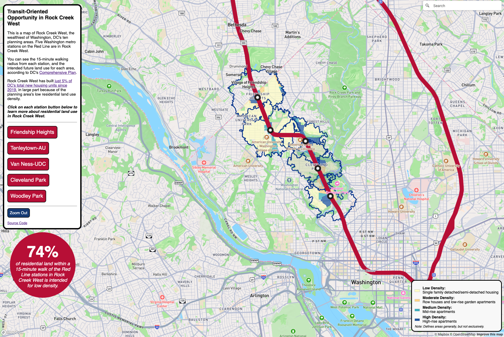

This is a class project to answer the following question: How much single-family zoning is there within a 15-minute walk of Washington, DC's West of the Park metro stations? 

West of the Park is one of ten DC Office of Planning neighborhood planning areas. It is the city's wealthiest and whitest, with the highest concentration of exlusionary zoning. DC's Future Land Use Map guides future zoning changes in the city. The Future Land Use Map designates nearly 75% of the residential land use within a 15-minute walk of these stations for low-density. Highlighting that can help build political support for more equitable housing construction in Washington, DC.

The current version of the live site is here: https://defrank1.github.io/class-3-project/

Residential land use category data was sourced from DC Open Data: https://opendata.dc.gov/datasets/DCGIS::future-land-use/about and planning areas from: https://opendata.dc.gov/datasets/203c2342b36240949e0ad95d75a5bdca_2/explore?location=38.938220%2C-77.055362%2C13.00. QGIS was used to consolidate land use categories and save as geojson files. 

TravelTime API was used to generate the 15-minute walkshed, and JoshData's wmata-track-locations repository was used to generate station lines: https://github.com/JoshData/wmata-track-locations. Stations themselves were sourced from WMATA's developer tools. The icons were created by yours truly in Adobe Illustrator.

